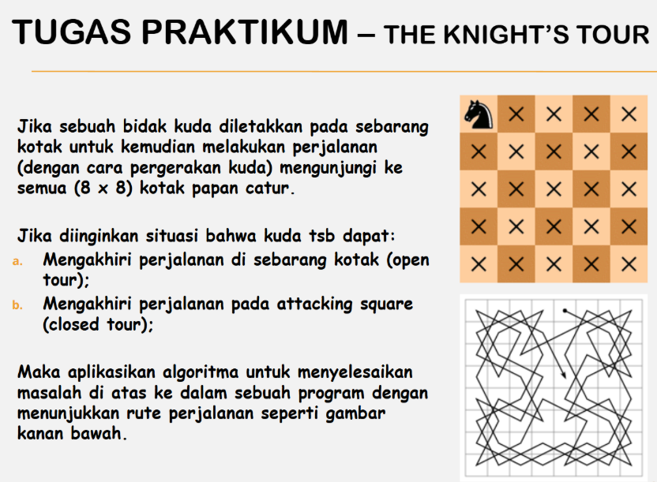
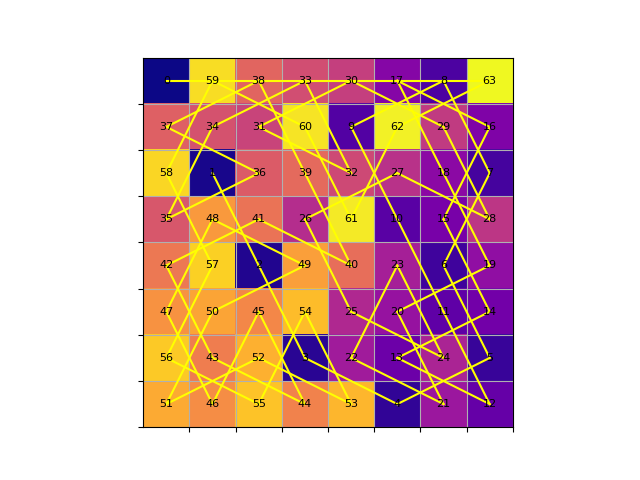
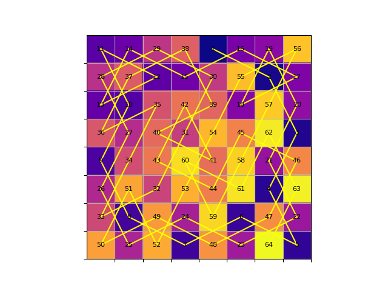
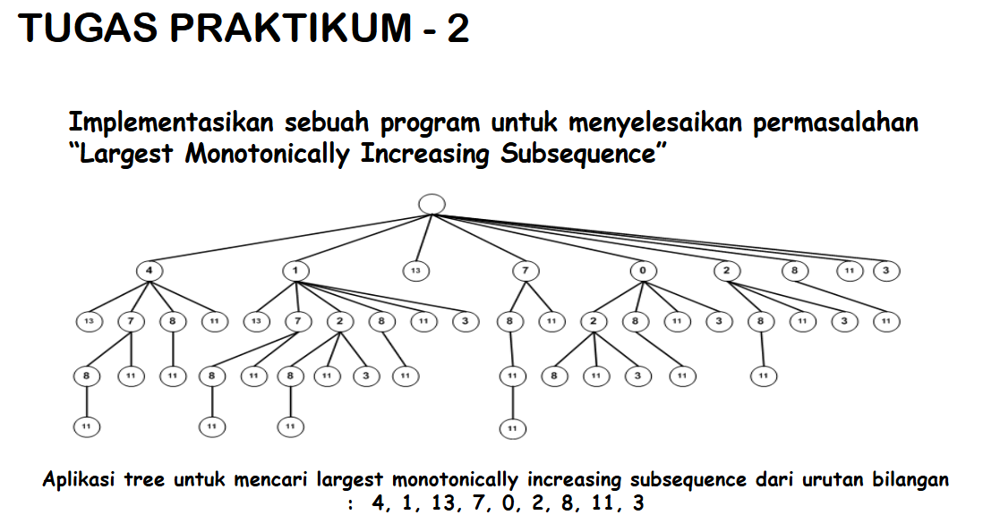

# Final Praktikum Kelompok 10

Hasil Praktikum 1 dan 2 Mata Kuliah Teori Graf oleh Kelompok 10

### Anggota Kelompok 10

|                       Nama                               		                	|    NRP     |
| :---------------------------------------------------------------------------: | :--------: |
|   [Farrel Hasudungan Immanuel Limbong](https://github.com/farelhasudungan)  	| 5025241016 |
|   [Jahhaza Assiqooyah Nurul Hidayah](https://github.com/jahhaza)             	| 5025241019 |
|   [Muhammad Hilman Azhar](https://github.com/hilmanazhar) 			              | 5025241264 |

## Daftar Isi
- [Praktikum 1](#praktikum-1)
  - [Soal Praktikum 1](![soal-1.png])
  - [Penjelasan Singkat Permasalahan Dengan Backtracking](#penjelasan-singkat-permasalahan-dengan-backtracking)
  - [Penjelasan Singkat Permasalahan Dengan Heuristic](#penjelasan-singkat-permasalahan-dengan-heuristic)
  - [Penyelesain Praktikum 1 Dengan Backtracking](#penyelesaian-praktikum-2-dengan-backtracking)
  - [Penyelesain Praktikum 1 Dengan Heuristic](#penyelesaian-praktikum-2-dengan-heuristic)
  - [Analisis](#analisis)
- [Praktikum 2](#praktikum-2)
  - [Soal Praktikum 2](#soal-praktikum-2) 
  - [Penjelasan Singkat LMIS](#penjelasan-singkat-LMIS)
  - [Penyelesaian Praktikum 2](#penyelesaian-praktikum-2)
  - [Analisis](#analisis)
- [Referensi](#referensi)
 
## Praktikum 1


### Soal Praktikum 1
> Jika sebuah bidak kuda diletakkan pada sebarang kotak untuk kemudian melakukan perjalanan (dengan cara pergerakan kuda) mengunjungi ke semua (8x8) kotak papan catur. Jika diinginkan situasi bahwa kuda tsb dapat mengakhiri perjalnaan pada attacking square, mengakhiri perjalanan di sebarang kotak. Maka aplikasikan algoritma untuk menyelesaikan masalah diatas ke dalam sebuah program dengan menunjukkan rute perjanlanan seperti gambar kanan bawah

### Penjelasan Singkat Permasalahan Dengan Backtracking
Berdasarkan soal masalah tersebut dikenal sebagai “Knight’s Tour Problem” dan dapat diselesaikan menggunakan algoritma backtracking dan heuristic. Algoritma backtracking adalah teknik rekursif yang digunakan untuk menyelesaikan masalah optimasi. Ini mencoba untuk membangun solusi secara inkremental, satu bagian pada satu waktu, sambil mempertimbangkan batasan masalah. Berikut adalah algoritma backtracking untuk menyelesaikan masalah Knight’s Tour:
- Mulai dari kotak awal.
- Jika semua kotak telah dikunjungi, kembalikan true.
- Untuk setiap langkah yang mungkin dari kotak saat ini, lakukan langkah berikutnya.
- Jika langkah berikutnya mengarah ke solusi, kembalikan true.
- Batalkan langkah dan coba langkah lainnya.
- Jika tidak ada langkah yang mungkin, kembalikan false.


### Penjelasan Singkat Permasalahan Dengan Heuristic
Berdasarkan soal masalah tersebut dikenal sebagai “Knight’s Tour Problem” dan dapat diselesaikan menggunakan algoritma backtracking dan heuristic. Heuristik adalah pendekatan berbasis aturan atau pengetahuan yang digunakan untuk memandu pencarian solusi dengan tujuan meningkatkan efisiensi. Dalam konteks tur kuda catur, heuristik dapat digunakan untuk memandu pemilihan langkah pertama yang lebih mungkin mengarah ke solusi akhir. Heuristik tidak menjamin solusi optimal, tetapi dapat mengurangi kompleksitas pencarian.


### Penyelesaian Praktikum 1 Dengan Backtracking
Berikut adalah snippet kode Python yang mengimplementasikan algoritma backtracking untuk menyelesaikan masalah Knight's Tour:

```ruby
import matplotlib.pyplot as plt
import numpy as np

def isSafe(x, y, board, N):
    return x >= 0 and y >= 0 and x < N and y < N and board[x][y] == -1

def printSolution(board, N):
    for i in range(N):
        for j in range(N):
            print(board[i][j], end=' ')
        print()

def solveKT():
    N = 8 
    board = [[-1 for _ in range(N)] for _ in range(N)]
    move_x = [2, 1, -1, -2, -2, -1, 1, 2]
    move_y = [1, 2, 2, 1, -1, -2, -2, -1]
    board[0][0] = 0
    pos = 1
    if not solveKTUtil(board, 0, 0, move_x, move_y, pos, N):
        print("Solution does not exist")
    else:
        return board  

def solveKTUtil(board, curr_x, curr_y, move_x, move_y, pos, N):
    if pos == N * N:
        return True
    for i in range(8):
        new_x = curr_x + move_x[i]
        new_y = curr_y + move_y[i]
        if isSafe(new_x, new_y, board, N):
            board[new_x][new_y] = pos
            if solveKTUtil(board, new_x, new_y, move_x, move_y, pos + 1, N):
                return True
            board[new_x][new_y] = -1
    return False

solution_board = solveKT()

def visualize_knight_tour(board):
    N = len(board)
    chessboard = np.array(board)
    pair_array = np.zeros((N * N, 2), dtype=int)

    fig, ax = plt.subplots()
    ax.set_xticks(np.arange(0.5, N, 1))
    ax.set_yticks(np.arange(0.5, N, 1))
    ax.set_xticklabels([])
    ax.set_yticklabels([])
    ax.grid(which="both")
    ax.imshow(chessboard, cmap="plasma")  

    for i in range(N):
        for j in range(N):
            if chessboard[i, j] != -1:
                ax.text(j, i, str(chessboard[i, j]), ha="center", va="center", fontsize=8)
                pair_array[chessboard[i, j] - 1] = (j, i)

    for k in range(len(pair_array) - 1):
        j, i = pair_array[k]
        next_j, next_i = pair_array[k + 1]
        ax.plot([j, next_j], [i, next_i], color='yellow')  

    plt.show()

visualize_knight_tour(solution_board)
```

Berikut adalah penjelasan singkat dari setiap fungsi dalam program kami:

#### Fungsi isSafe(x, y, board, N)
```ruby
def isSafe(x, y, board, N):
    return x >= 0 and y >= 0 and x < N and y < N and board[x][y] == -1
```
Fungsi ini memeriksa apakah langkah yang diinginkan (x, y) aman untuk dilewati. Langkah dikatakan aman jika koordinat berada di dalam batas papan dan belum dikunjungi.

#### Fungsi printSolution(board, N)
```ruby
def printSolution(board, N):
    for i in range(N):
        for j in range(N):
            print(board[i][j], end=' ')
        print()
```
Fungsi ini mencetak solusi pada papan catur. Fungsi ini tidak digunakan dalam program ini, tetapi dapat digunakan untuk mencetak solusi ke konsol.

#### Fungsi solveKT()
```ruby
def solveKT():
    N = 8 
    board = [[-1 for _ in range(N)] for _ in range(N)]
    move_x = [2, 1, -1, -2, -2, -1, 1, 2]
    move_y = [1, 2, 2, 1, -1, -2, -2, -1]
    board[0][0] = 0
    pos = 1
    if not solveKTUtil(board, 0, 0, move_x, move_y, pos, N):
        print("Solution does not exist")
    else:
        return board
```
Fungsi ini melakukan inisialisasi papan catur, mendefinisikan gerakan langkah kuda `(move_x dan move_y)`, menetapkan posisi awal kuda, dan memanggil fungsi utilitas `solveKTUtil`.

#### Fungsi solveKTUtil()
```ruby
def solveKTUtil(board, curr_x, curr_y, move_x, move_y, pos, N):
    if pos == N * N:
        return True
    for i in range(8):
        new_x = curr_x + move_x[i]
        new_y = curr_y + move_y[i]
        if isSafe(new_x, new_y, board, N):
            board[new_x][new_y] = pos
            if solveKTUtil(board, new_x, new_y, move_x, move_y, pos + 1, N):
                return True
            board[new_x][new_y] = -1
    return False
```
Fungsi utilitas ini merupakan implementasi rekursif dari algoritma backtracking untuk menyelesaikan masalah tur kuda catur. Jika langkah yang diambil membawa ke solusi, fungsi akan mengembalikan True, dan sebaliknya.

#### Visualisasi Solusi dengan visualize_knight_tour(board)
```ruby
solution_board = solveKT()
visualize_knight_tour(solution_board)
```
Program memanggil fungsi `solveKT` untuk mendapatkan solusi dan kemudian memvisualisasikan solusi tersebut dengan menggunakan fungsi `visualize_knight_tour`.

#### Fungsi visualize_knight_tour(board)
```ruby
def visualize_knight_tour(board):
    # ...
```
Fungsi ini menggunakan Matplotlib untuk membuat visualisasi dari solusi tur kuda catur pada papan 8x8. Menunjukkan langkah-langkah kuda dan jalur tur kuda dengan warna kuning.


#### Hasil Ouput Program Backtracking




### Penyelesaian Praktikum 1 Dengan Heuristic
Berikut adalah snippet kode Python yang mengimplementasikan algoritma heuristic untuk menyelesaikan masalah Knight’s Tour:

```ruby
import matplotlib.pyplot as plt
import numpy as np

BOARD_SIZE = 8
MOVES = [(1, 2), (1, -2), (2, 1), (2, -1), (-1, 2), (-1, -2), (-2, 1), (-2, -1)]

def is_within_board(x, y):
    return (0 <= x < BOARD_SIZE) and (0 <= y < BOARD_SIZE)

def generate_closed_tour():
    board = np.full((BOARD_SIZE, BOARD_SIZE), -1)
    x, y = 4, 0
    board[y][x] = 1

    for step in range(2, BOARD_SIZE ** 2 + 1):
        possible_moves = []
        for dx, dy in MOVES:
            new_x, new_y = x + dx, y + dy
            if is_within_board(new_x, new_y) and board[new_y][new_x] == -1:
                move_count = sum(
                    is_within_board(new_x + mx, new_y + my) and board[new_y + my][new_x + mx] == -1
                    for mx, my in MOVES
                )
                possible_moves.append((move_count, (new_x, new_y)))

        if not possible_moves:
            return False

        x, y = min(possible_moves)[1]
        board[y][x] = step

    visualize_knights_tour(board)
    return True

def visualize_knights_tour(board):
    fig, ax = plt.subplots()
    ax.set_xticks(np.arange(0.5, BOARD_SIZE, 1))
    ax.set_yticks(np.arange(0.5, BOARD_SIZE, 1))
    ax.set_xticklabels([])
    ax.set_yticklabels([])
    ax.grid(which="both")
    ax.imshow(board, cmap="plasma")

    for i in range(BOARD_SIZE):
        for j in range(BOARD_SIZE):
            if board[i][j] != -1:
                ax.text(j, i, str(board[i][j]), ha="center", va="center", fontsize=8)

    pair_array = np.zeros((BOARD_SIZE * BOARD_SIZE, 2), dtype=int)
    for i in range(BOARD_SIZE):
        for j in range(BOARD_SIZE):
            if board[i][j] != -1:
                pair_array[board[i][j] - 1] = (j, i)

    for k in range(len(pair_array) - 1):
        j, i = pair_array[k]
        next_j, next_i = pair_array[k + 1]
        ax.plot([j, next_j], [i, next_i], color='yellow')

    plt.show()

if __name__ == '__main__':
    while not generate_closed_tour():
        pass
```

Berikut adalah penjelasan singkat dari setiap fungsi dalam program kami:

#### Inisialisasi Konstanta dan Gerakan (Moves)
```ruby
BOARD_SIZE = 8
MOVES = [(1, 2), (1, -2), (2, 1), (2, -1), (-1, 2), (-1, -2), (-2, 1), (-2, -1)]
```
- `BOARD_SIZE` Menyimpan ukuran papan catur (8x8).
- `MOVES` Menyimpan semua kemungkinan gerakan kuda catur dalam bentuk perubahan koordinat.

#### Fungsi is_within_board
```ruby
def is_within_board(x, y):
    return (0 <= x < BOARD_SIZE) and (0 <= y < BOARD_SIZE)
```
Fungsi ini memeriksa apakah suatu koordinat berada dalam batas papan catur.

#### Fungsi generate_closed_tour
```ruby
def generate_closed_tour():
    # ...
```
Fungsi ini mencoba menghasilkan tur kuda catur yang menutupi seluruh papan. Jika berhasil, fungsi akan memanggil visualize_knights_tour untuk menampilkan hasilnya.

#### Fungsi visualize_knights_tour
```ruby
def visualize_knights_tour(board):
    # ...
```
Fungsi ini memvisualisasikan tur kuda catur pada papan menggunakan Matplotlib. Koordinat dan urutan gerakan ditampilkan di atas papan, dan jalur tur dihubungkan dengan garis kuning.

#### Loop Utama
```ruby
if __name__ == '__main__':
    while not generate_closed_tour():
        pass
```
Program utama yang mencoba menghasilkan tur kuda catur yang menutupi seluruh papan. Loop ini terus berjalan hingga tur berhasil dibuat.

#### Hasil Output Program Heuristic




### Analisis Cara 
Berdasarkan kedua pendeketan yang kami lakukan yaitu dengan Backtracking dan Heuristic. Berikut kesimpulan yang kami dapatkan :
Pada metode Backtracking, program mencoba setiap kemungkinan langkah kuda mulai dari posisi awal. Setiap langkah diperiksa apakah masih berada di dalam papan dan belum pernah dikunjungi. Jika suatu langkah tidak bisa dilanjutkan, program akan kembali ke langkah sebelumnya (backtrack) dan mencoba alternatif lain hingga seluruh 64 petak berhasil dilalui tepat satu kali.

Sedangkan pada metode Heuristic, program memilih langkah yang paling sedikit memiliki pilihan gerakan berikutnya. Dengan strategi ini, pencarian solusi menjadi lebih cepat karena program menghindari area yang berpotensi membuat kuda terjebak. Setelah semua petak berhasil dikunjungi, hasil langkah kuda ditampilkan dalam bentuk visualisasi pada papan catur.


## Praktikum 2


### Soal Praktikum 2

> Implemantasikan sebuah program untuk menyelesaikan permasalahan “Largest Monotonically Increasing Subsequence”

### Penjelasan Singkat LMIS
“Largest Monotonically Increasing Subsequence” adalah subsequence terpanjang dari suatu sequence yang elemen-elemennya meningkat secara monotonik. Untuk menyelesaikan permasalahan ini, kita dapat menggunakan algoritma Longest Increasing Subsequence (LIS) dengan kompleksitas waktu `O(N log N)` 

### Penyelesaian Praktikum 2
Berikut adalah implementasi algoritma LMIS menggunakan bahasa pemrograman Python yang telah kami buat:

```ruby
def LMIS(nums):
    n = len(nums)
    if n == 0:
        return 0, []

    # Initialize an array to store the length of the longest increasing subsequence
    lis_length = [1] * n

    # Initialize an array to store the LMIS
    lis_list = [[num] for num in nums]

    # Perform dynamic programming to find the LMIS
    for i in range(1, n):
        for j in range(0, i):
            if nums[i] > nums[j] and lis_length[i] < lis_length[j] + 1:
                lis_length[i] = lis_length[j] + 1
                lis_list[i] = lis_list[j] + [nums[i]]

    # Find the maximum length of the LMIS
    max_lmis_index = lis_length.index(max(lis_length))
    max_lmis = lis_list[max_lmis_index]

    return max_lmis

# User input for the list of numbers
user_input = input("Enter a list of numbers separated by spaces: ")
nums = list(map(int, user_input.split()))

# Calculate and display the LMIS
lmis = LMIS(nums)
print("Length of LMIS is", len(lmis))
print("Longest Monotonically Increasing Subsequence (LMIS):", lmis)
```

Berikut adalah penjelasan singkat dari program di atas:

```ruby
def LMIS(nums):

# ...

    return max_lmis
```

Fungsi LMIS mengambil list bilangan `nums` sebagai input dan mengembalikan tuple yang berisi panjang dari LMIS dan LMIS itu sendiri.

```ruby
n = len(nums)
if n == 0:
    return 0, []
```

Bagian ini akan mengecek apakah list input kosong atau tidak. Jika kosong, maka fungsi LMIS akan mengembalikan tuple `(0, [])` yang berarti panjang LMIS adalah 0 dan LMIS tersebut merupakan sebuah list kosong.

```ruby
lis_length = [1] * n

lis_list = [[num] for num in nums]
```

Di sini, dua buah array diinisialisasi:
- `lis_length`: Array untuk menyimpan panjang dari subsequence terpanjang pada tiap index. Pada awalnya array ini diisi dengan bilangan 1 dengan panjang yang sama seperti input list.
- `lis_list`: Array dari kumpulan array untuk menyimpan subsequences yang sesuai dengan tiap index. Setiap elemen lis_list ini awalnya berupa list tunggal yang berisi bilangan sesuai list input.

```ruby
for i in range(1, n):
    for j in range(0, i):
        if nums[i] > nums[j] and lis_length[i] < lis_length[j] + 1:
            lis_length[i] = lis_length[j] + 1
            lis_list[i] = lis_list[j] + [nums[i]]
```

For loop ini menggunakan *dynamic programming* untuk menemukan LMIS. Iterasi akan dilakukan untuk setiap pasangan indeks i dan j, di mana i > j.

Jika bilangan pada indeks i lebih besar dari bilangan pada indeks j dan panjang LMIS yang berakhir pada indeks i lebih kecil dari panjang LMIS yang berakhir pada indeks j ditambah satu, maka panjang dan subsequence pada indeks i diperbarui.

```ruby
max_lmis_index = lis_length.index(max(lis_length))
max_lmis = lis_list[max_lmis_index]
```

Kemudian, program akan mencari indeks dengan panjang LMIS terbesar (`max_lmis_index`) dan juga elemen dari LMIS tersebut (`max_lmis`).

```ruby
user_input = input("Enter a list of numbers separated by spaces: ")
nums = list(map(int, user_input.split()))

lmis = LMIS(nums)
```

Bagian ini meminta input dari user berupa list bilangan yang dipisahkan oleh spasi (`user_input`). Input yang berbentuk string ini akan diubah menjadi list integer (`nums`). Fungsi LMIS dipanggil dengan list input dan nilai yang dikembalikan (panjang dan LMIS) disimpan dalam variabel `lmis`.

```ruby
print("Length of LMIS is", len(lmis))
print("Longest Monotonically Increasing Subsequence (LMIS):", lmis)
```

Terakhir, panjang dan elemen dari LMIS yang telah diperoleh akan ditampilkan.

### Output Hasil Program


### Analisis Cara
Program ini bekerja dengan cara membangun urutan angka yang selalu meningkat dari kiri ke kanan dalam daftar. Setiap angka pada awalnya dianggap sebagai sebuah urutan kecil. Lalu saat program membaca angka berikutnya, angka tersebut dibandingkan dengan semua angka sebelumnya. Jika ditemukan angka sebelumnya yang lebih kecil, berarti angka ini bisa melanjutkan urutan peningkatan tersebut. Program kemudian memilih lanjutan urutan yang paling panjang untuk setiap angka, sehingga setiap langkah selalu menghasilkan urutan meningkat terbaik hingga posisi itu.

Dengan cara itu, program terus menyimpan semua kemungkinan urutan yang meningkat sambil memperpanjang yang terbaik. Setelah semua angka diperiksa, program tinggal memilih urutan terpanjang dari seluruh yang sudah terbentuk. Urutan itulah yang disebut sebagai Largest Monotonically Increasing Subsequence atau LMIS. Jadi singkatnya, program menemukan solusi dengan selalu membandingkan angka baru dengan angka-angka sebelumnya, memperpanjang urutan yang bisa meningkat, lalu mengambil urutan yang paling panjang sebagai hasil akhirnya.

## Referensi
### Referensi Soal Praktikum 1
- [amenimethenni/AlgorithmesGenetiques](https://github.com/amenimethenni/AlgorithmesGenetiques/blob/010c1d89ea63d95641936387ff7b1fcfc791d19a/Knight's_Tour_Pb.py)
- [Muhammad-Osama31/AI-N-Queen-Probelm](https://github.com/Muhammad-Osama31/AI-N-Queen-Probelm/blob/30718960445832e8b86cb53e630413ec12c7f340/Knight.py)
- [huytran-cloud/TranDangHuy-C4T-A03](https://github.com/huytran-cloud/TranDangHuy-C4T-A03/blob/cfa4638ae6ee32af499569a30eeda62e87acafc4/TranDangHuy-C4T-A03/Chess-Knight/KnightsTour.py)
- [FedorBel/algorythms](https://github.com/FedorBel/algorythms/blob/d51ad4252b5b37b31765af4b5f16746f2675548f/knights_tour/knights_tour.py)
- [Tutorialspoint - The Knight's Tour Problem](https://www.tutorialspoint.com/The-Knight-s-tour-problem)
- [Runestone Academy - Implementing Knight's Tour](https://runestone.academy/ns/books/published/pythonds/Graphs/ImplementingKnightsTour.html)
- [Stack Overflow - Knights Tour Count Steps](https://stackoverflow.com/questions/39628430/knights-tour-count-steps-that-takes-to-go-from-a-to-b)
- [GeeksforGeeks - The Knight's Tour Problem](https://www.geeksforgeeks.org/the-knights-tour-problem/)

### Referensi Soal Praktikum 2
- [sushiljacksparrow/Python_Practice](https://github.com/sushiljacksparrow/Python_Practice/blob/e59e4dae227d60b5b93f4f8371c287cc1fa41450/longest_bitonic_susequence.py)
- [GeeksforGeeks - Longest Monotonically Increasing Subsequence](https://www.geeksforgeeks.org/longest-monotonically-increasing-subsequence-size-n-log-n-simple-implementation/)
- [Stack Overflow - Obtaining the Longest Increasing Subsequence in Python](https://stackoverflow.com/questions/27324717/obtaining-the-longest-increasing-subsequence-in-python)
- [Stack Overflow - Largest Monotonically Increasing or Decreasing Subsequence](https://stackoverflow.com/questions/40337207/largest-monotonically-increasing-or-decreasing-subsequence)
- [GeeksforGeeks - Set Insert Function in C++ STL](https://www.geeksforgeeks.org/set-insert-function-in-c-stl/)
- [GeeksforGeeks - Longest Monotonically Increasing Subsequence N Log N](https://www.geeksforgeeks.org/longest-monotonically-increasing-subsequence-size-n-log-n/)
- [Dynamic Programming 7 - Longest Increasing Subsequence](https://homepages.gac.edu/~sskulrat/Courses/2014F-375/lectures/dp7.pdf)
